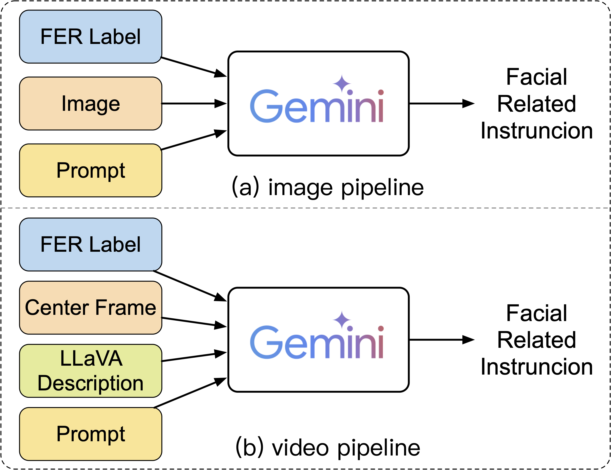
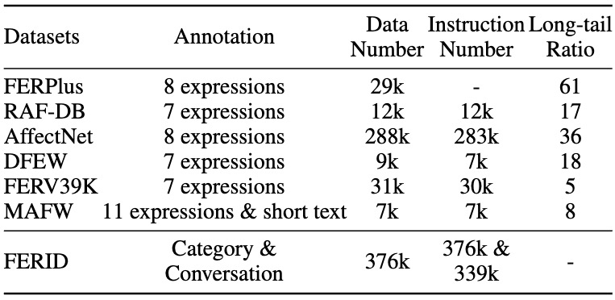
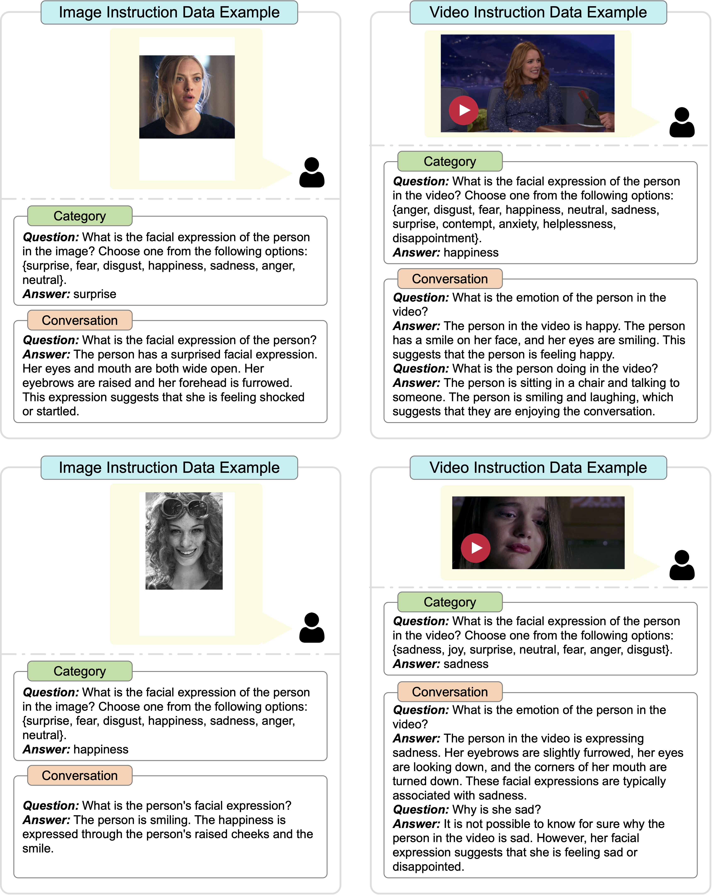

# Facial Expression Recognition  Instruction Dataset （FERID)

# 📰 News

- **[2025-01]: The MAFW part in FERID is now available at [Google Drive](https://drive.google.com/drive/folders/1IUTM9gRHy406U1hM4hsOaPtzPg1o8g3L?usp=drive_link)**

# ✏️ Abstract

Facial expression recognition (FER) has emerged as an important research topic in recent years. However, current FER paradigms face challenges in generalization, lack semantic information aligned with natural language, and struggle to process both images and videos within a unified framework. Multimodal Large Language Models (MLLMs) have recently achieved success, offering advantages in addressing these issues and potentially overcoming the limitations of current FER paradigms. Nonetheless, directly applying pre-trained MLLMs to FER remains challenging due to insufficient instruction datasets and the inability of vision encoders to extract fine-grained facial information. Our zero-shot evaluations of existing open-source MLLMs on FER reveal a significant performance gap compared to GPT-4V and state-of-the-art supervised methods. In this paper, we aim to enhance MLLMs’ capabilities in understanding facial expressions. We first introduce a facial expression recognition instruction dataset (*FERID*), which has 376k category instructions and 339k conversational instructions. We then propose a novel MLLM, named *EMO-LLaMA*, which incorporates facial priors from a pretrained facial analysis network to enhance its understanding of human facial information. Specifically, we design a Face Info Mining module to extract both global and local facial information. Furthermore, we utilize a handcrafted prompt to introduce age-gender-race attributes, considering the emotional differences across diverse human groups. Extensive experiments show that EMO-LLaMA achieves results comparable to or competitive with SOTA on both static and dynamic FER datasets. The instruction dataset and code will be available on GitHub.

# 📝 Dataset Generation

## Instruction Data Generation Pipeline

## Statistics

## Instruction Exmaple

